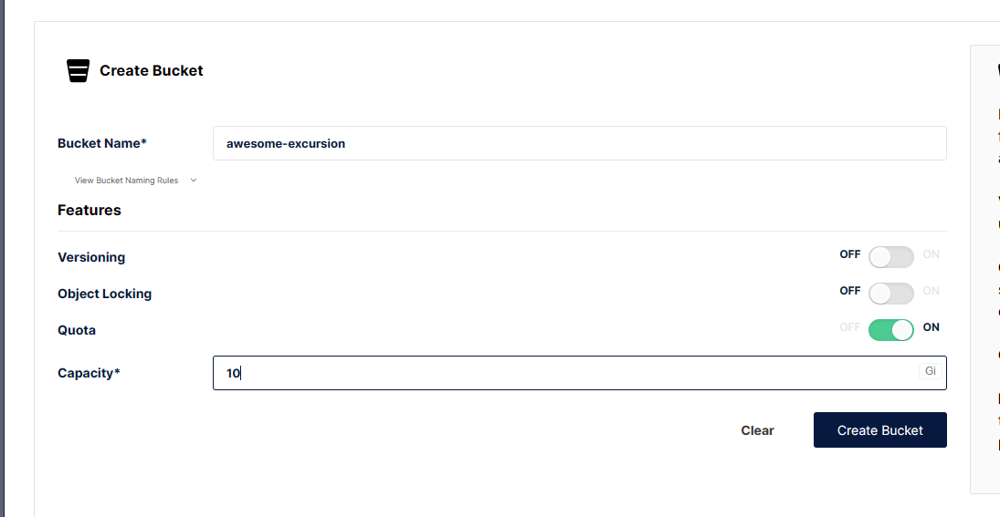
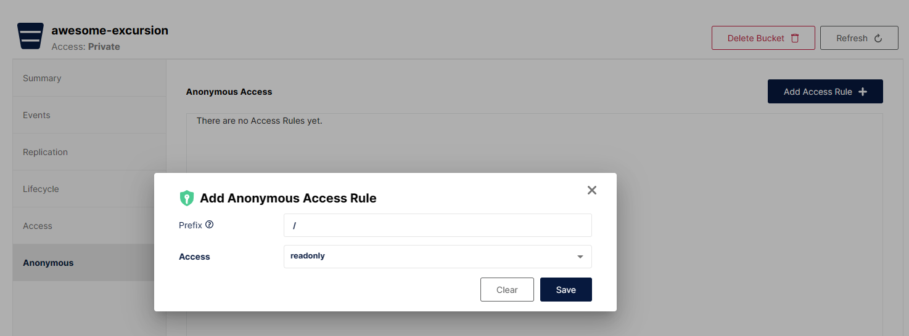
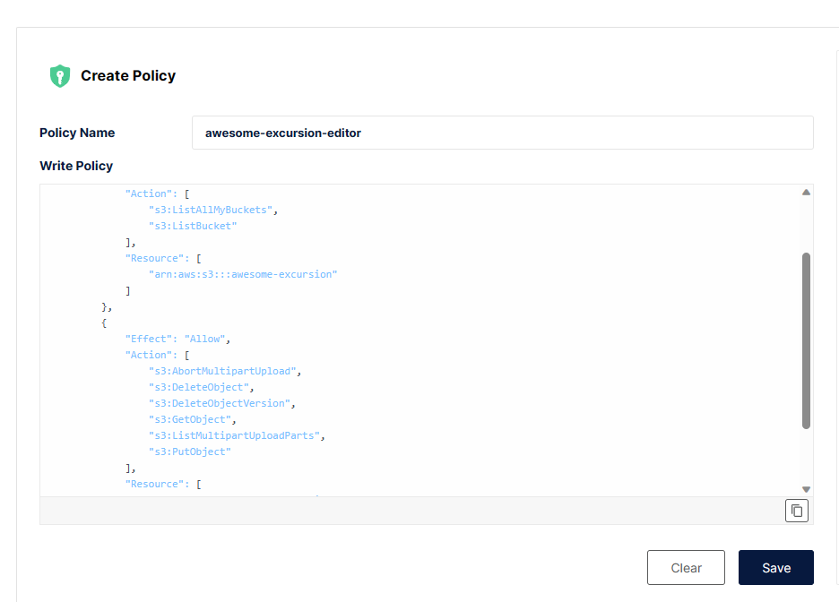
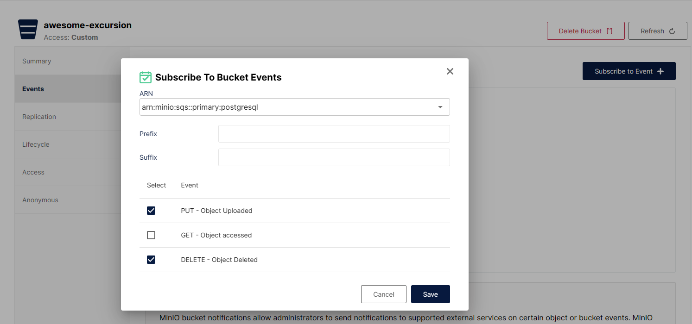
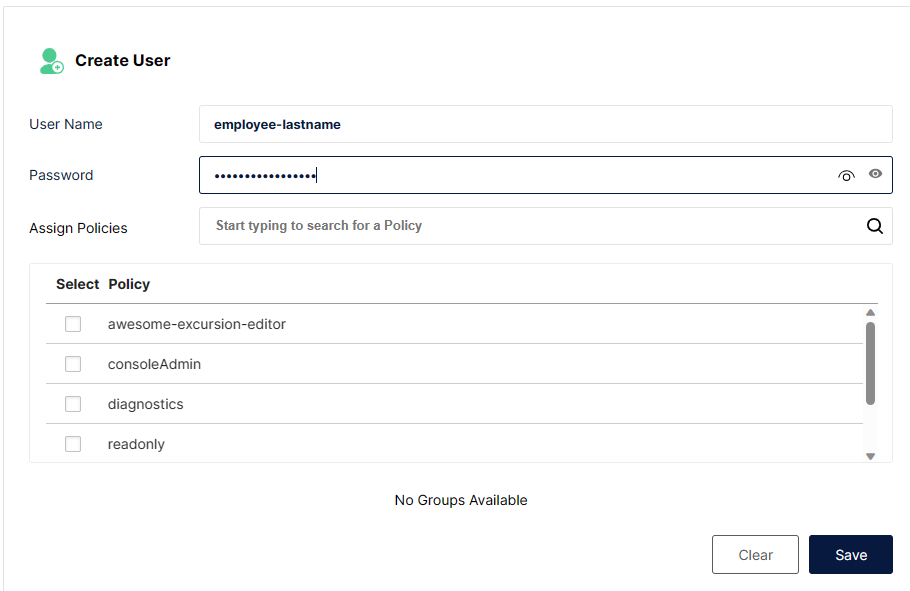
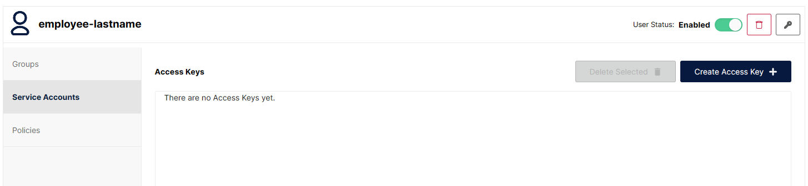
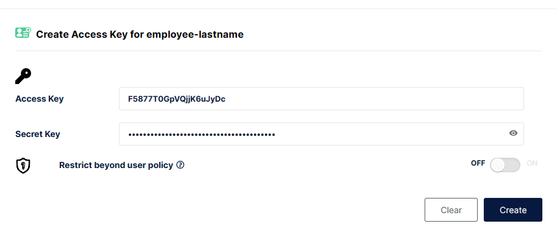
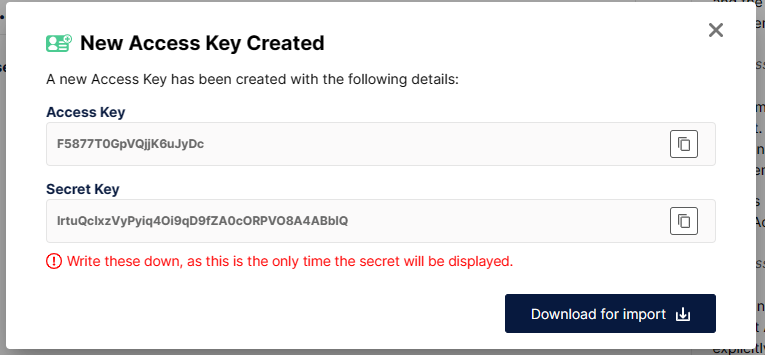

# MinIO в docker compose и логами

## Запуск
1. Склонировать репозиторий
2. Заполнить файл `.env` необходимыми переменными окружения. Для паролей можно использовать [генератор](https://www.random.org/passwords/?num=1&len=24&format=html&rnd=new)
```env
# Обязательно
ROOT_REDIRECT_URL=https://cataas.com/cat/says/hello%20world!
MINIO_ROOT_USER=minio-admin # логин администратора сервера
MINIO_ROOT_PASSWORD=password # пароль администратора сервера
POSTGRES_PASSWORD=password # пароль postgres сервера под пользователем `postgres`, из под него будут складываться события minio

# Опционально
POSTGRES_LISTEN_ON_HOST_PORT=5432 # в какой порт будет проброшен 5432 порт постгресса на машине (удобно, если 5432 уже занят)

```
3. Запустить сервисы
```bash
docker compose up -d
```
Машина будет слушать на следующих портах:
- `80`: само S3
- `9090`: панель администратора (консоль)
- `$POSTGRES_LISTEN_ON_HOST_PORT`: Postgres сервер, в котором будут находиться события


## Методичка по добавлению нового бакета и пользователя

### Создание бакета

1. Создать бакет. Стоит указать квоту на его размер, версионирование и возможность блокировать файлы является избыточной.
    
2. Выдать анонимный доступ на чтение всех файлов бакета. Все файлы в нем будут доступны по пути `/<название бакета>/<путь к файлу в бакете>`
    
3. Создать политику редактора этого бакета. Данная политика выдает разрешение пользователю манипулировать файлами в бакете.
    ```json
    {
        "Version": "2012-10-17",
        "Statement": [
        {
            "Effect": "Allow",
            "Action": [
                "s3:ListAllMyBuckets",
                "s3:ListBucket"
            ],
            "Resource": [
                "arn:aws:s3:::НАЗВАНИЕ_БАКЕТА"
            ]
        },
        {
            "Effect": "Allow",
            "Action": [
                "s3:AbortMultipartUpload",
                "s3:DeleteObject",
                "s3:DeleteObjectVersion",
                "s3:GetObject",
                "s3:ListMultipartUploadParts",
                "s3:PutObject"
            ],
            "Resource": [
                "arn:aws:s3:::НАЗВАНИЕ_БАКЕТА/*"
            ]
        }
      ]
    }
    ```

    

<a name="setup-subscribe"></a>

4. Настроить отправку важных событий по этому бакету в хранилище. `GET` указывать не стоит, поскольку бакет публичный, и таких событий может быть бесконечно много.
   

### Создание пользователя-редактора
1. Создать пользователя. (Шаг опциональный, если у пользователя уже есть его секреты для доступа). Политику можно выбрать при создании.

    
2. Привязать к пользователю необходимые политики.

    
3. Создать ключ доступа для пользователя. Дополнительно ограничивать доступ именно этого ключа не обязательно, таким образом можно будет дополнять эту пару доступа в последствии.

    

    

    `Access Key` и `Secret Key` необходимо передать сотруднику безопасным образом. `Secret Key` просмотреть после закрытия модального окна будет уже нельзя.

    


## Просмотр событий
Для контроля за тем, кто и что сделал на сервере можно просмотреть таблицу `minioevents` в базе данных `postgres` в сервере, доступным на порту `$POSTGRES_LISTEN_ON_HOST_PORT`.

Для того, чтобы события добавлялись в таблицу, необходимо для бакета [настроить правило отправки этих событий](#setup-subscribe).

Пример скрипта:

```sql
SELECT 
	event_time,
	ev->'s3'->'bucket'->>'name' as bucket,
	ev->'userIdentity'->>'principalId' as user_id,
	replace(ev->'s3'->'object'->>'key', '%2F', '/') as key,
	ev->>'eventName' as action
	FROM (SELECT event_time, jsonb_array_elements(minioevents.event_data -> 'Records') as ev FROM minioevents) as src
```


## Полезные инструменты

### S3
1. [Cyberduck](https://cyberduck.io/) - удобный инструмент для работы с объектными хранилищами
2. [S3 Browser](https://s3browser.com/) - узконаправленный клиенты для работы с S3 хранилищами


